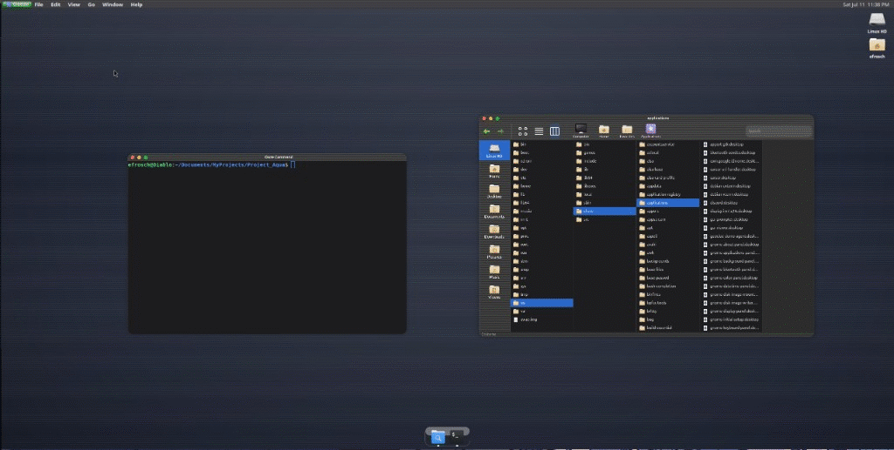

# Ooze

**Ooze** is an experimental desktop environment built on [Mutter](https://gitlab.gnome.org/GNOME/mutter)’s Wayland compositor. It explores a cohesive Aqua-inspired shell — menu bar, dock, traffic-light window chrome — with first-party GTK4 apps that share one drawing system.



*Light ↔ dark mode with Spot (file manager) and Ooze Command (terminal).*

---

## What this project is

Ooze started as a Mutter plugin / development-kit compositor (`my-desktop`) and grew into a small desktop stack:

| Piece | Role |
| --- | --- |
| **Compositor shell** | Top menu bar, dock, desktop icons, global appearance toggle |
| **Spot** | GTK4 / libadwaita file manager (sidebar, column & grid views) |
| **Ooze Command** | VTE-based terminal with traffic-light chrome and global menu |
| **OozeKit** | Shared C library for surfaces, pinstripes, buttons, and palette |

The goal is one visual language across shell and apps: charcoal / aluminum surfaces, subtle pinstripes, custom traffic lights, and light/dark mode driven by `org.gnome.desktop.interface color-scheme`.

---

## Features

### Desktop shell
- Mutter-based Wayland session (`--devkit`) for fast iteration
- Global menu bar with Ooze branding and appearance toggle
- Floating dock with **Spot** and **Ooze Command** by default
- Running-app indicators under dock icons
- Desktop icons (volume / home) using the elementary icon theme

### Spot
- Finder-style layout: places sidebar + toolbar + status bar
- Column (Miller) and grid views
- Column browser roots at the deepest matching sidebar place (Home, Downloads, …) so places and columns aren’t redundant
- Content area and chrome follow light/dark via OozeKit + Adwaita

### Ooze Command
- Embedded VTE terminal
- Same header chrome and traffic lights as Spot
- Application menu exposed for the shell’s global menu

### OozeKit
Single place to draw chrome so every Ooze app stays consistent:

- `ooze-palette` — light/dark color tables
- `ooze-draw` — surfaces, pinstripes, separators, button fills
- `ooze-surface` — header / toolbar / sidebar / statusbar widgets
- `ooze-button` — toolbar / push button chrome

---

## Screenshots

| Dark | Light |
| --- | --- |
|  |  |

---

## Build

**Dependencies (typical Debian/Ubuntu names):**

- `meson`, `ninja-build`, `pkg-config`
- Mutter 18 development packages (`libmutter-18-dev` and related)
- `libgtk-4-dev`, `libadwaita-1-dev`, `libcairo2-dev`
- `libvte-2.91-gtk4-dev` (for Ooze Command)
- `libgdk-pixbuf-2.0-dev`, `libpng-dev`

```bash
meson setup build
ninja -C build
```

Spot and Ooze Command are built when GTK4 + libadwaita (and VTE for Command) are available.

---

## Run

```bash
./run-devkit.sh
```

This launches a nested Mutter development-kit session with:

- `build/` on `PATH` (so Spot / Ooze Command resolve)
- a project-local GSettings keyfile backend (theme changes don’t touch your user dconf)
- elementary icons under `data/` (fetched on first build if missing)

Toggle light/dark from the **Ooze** menu; Spot and Ooze Command follow automatically.

For rebuild-on-save iteration:

```bash
./watch-devkit.sh
```

---

## Layout

```
src/           Compositor plugin (panel, dock, theme, menus, desktop icons)
spot/          Spot file manager
ooze-command/  Terminal app
ooze-kit/      Shared drawing toolkit (palette, surfaces, buttons)
ooze-ui/       Shared window chrome (header bar, traffic lights)
common/        Shared chrome constants / traffic-light drawing
data/          Icons, desktop entry, branding
docs/          README media (GIF + stills)
scripts/       Helper install scripts
```

---

## Status

Work-in-progress research desktop. Expect sharp edges: nested Mutter only, limited app set, and ongoing design polish. See `TODO.md` for the short checklist.

---

## License

See repository metadata / upstream Mutter licensing for compositor pieces. First-party Ooze code in this tree is part of the same project unless otherwise noted.
