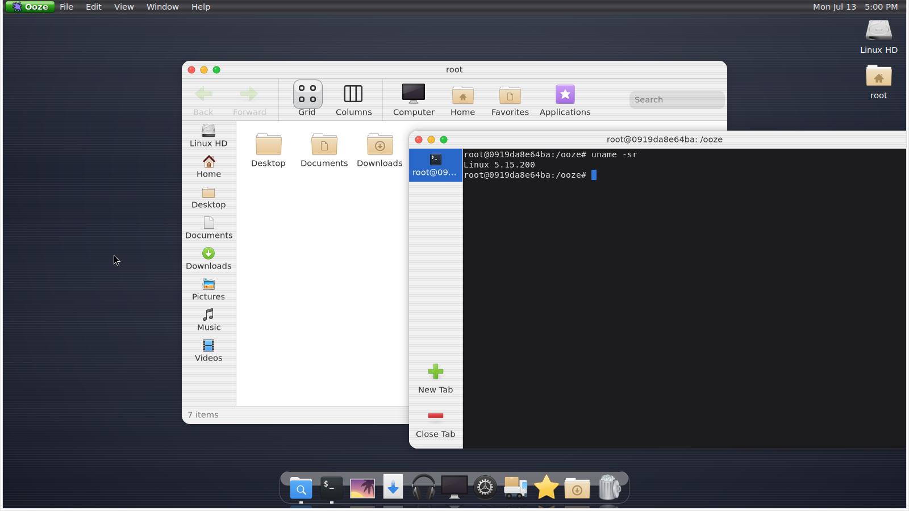
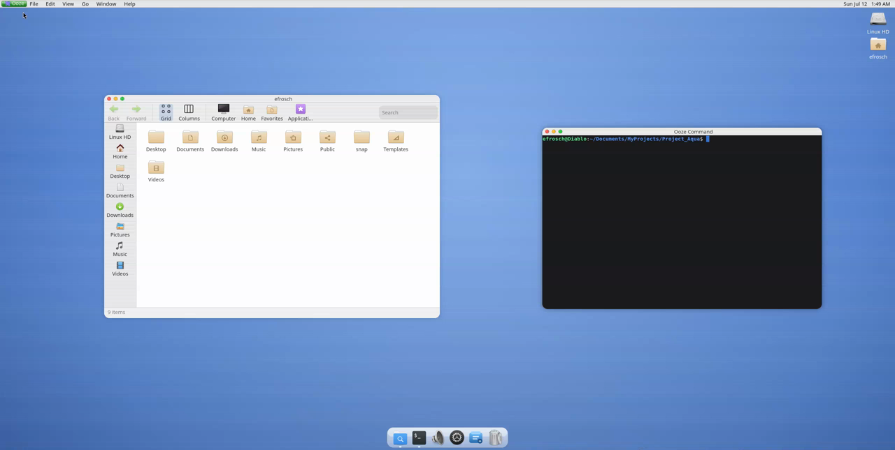

# Ooze

**Ooze** is a Wayland desktop environment built on [Mutter](https://gitlab.gnome.org/GNOME/mutter). It pairs a cohesive Aqua-inspired shell — menu bar, dock, and **Ooze Gel** — with first-party GTK4 applications that share one visual system.


*Nested Ooze session demo (autoplaying GIF). [Full-quality MP4](docs/ooze-desktop-demo.mp4) — same crop at native resolution.*

---

## Overview

| Component | Description |
| --- | --- |
| **Shell** | Global menu bar, dock, desktop icons, system appearance |
| **Spot** | File manager with sidebar, column, and grid views |
| **Ooze King** | System apps launcher (Spot, Command, Ear, Monitor, Pak, Torrent) |
| **Ooze Command** | Terminal with tabs, Ooze Gel, and global menu support |
| **Ooze Eye** | Image viewer (default handler for images in the nest) |
| **Ooze Torrent** | BitTorrent client (links static libtransmission; GPL binary) |
| **Ooze Monitor** | Display preferences via Mutter DisplayConfig |
| **Ooze Ear** | Sound preferences (PipeWire) |
| **Ooze Pak** | Flatpak package browser |
| **Ooze Gel** | App window frame — header bar, traffic lights, drag and resize |
| **OozeKit** | Shared drawing library for surfaces, pinstripes, buttons, and palette |

Shell and apps use one design language: aluminum surfaces, subtle pinstripes, custom traffic lights, and light/dark mode via `org.gnome.desktop.interface color-scheme`.

---

## Features

### Desktop shell
- Mutter-based Wayland compositor (`compositor/`)
- Global menu bar with appearance toggle and shell File / Edit / View / Go / Window / Help menus
- App menus from native GTK4 (`gtk_shell1`) and GTK3 / Xwayland via **appmenu-gtk-module** + dbusmenu
- Built-in XSETTINGS (menubar / appmenu / left-side decoration layout) when system `xsettingsd` is absent
- Floating dock with Spot, Command, and other Ooze apps
- Running-app indicators with focus / minimize on dock click
- Magic-lamp minimize animation into the dock
- Desktop icons with the elementary icon theme
- Optional WhiteSur GTK theme for **foreign** apps only (launch-scoped `GTK_THEME`, never a session-wide gtk-4.0 override)

### Spot
- Places sidebar, toolbar, and status bar
- Column (Miller) and grid views
- Column browser rooted at the active sidebar place
- Theme-aware surfaces through OozeKit and Gel
- Opens images in **Ooze Eye** via nest-local MIME defaults

### Ooze King
- Icon + label launcher for Ooze system apps
- Opens Spot, Ooze Command, Ooze Ear, Ooze Monitor, Ooze Pak, and Ooze Torrent

### Ooze Command
- VTE terminal with multiple tabs and New Tab control
- Shared Ooze Gel header bar and traffic lights
- Application menu for the shell global menu

### Ooze Eye
- Lightweight GTK4 image viewer with Ooze Gel
- Fit-to-window viewing and Open dialog
- Default image handler inside `./run-devkit.sh` (isolated `mimeapps.list`)

### Ooze Torrent
- First-party BitTorrent client with Ooze Gel and OozeKit
- Add torrent / magnet, pause, resume, remove, open download folder
- Links a project-local static `libtransmission` (GPL-2.0-or-later for this binary only)

### Ooze Monitor
- Display layout and resolution via Mutter’s DisplayConfig D-Bus API
- Nest-friendly mode list (`OOZE_DISPLAY_MODES` / `MUTTER_DEBUG_DUMMY_MODE_SPECS`)

### Ooze Gel
- `ooze-header-bar` — titled bar with traffic lights
- `ooze-traffic-lights` — close / minimize / zoom
- `ooze-gel` — window drag and edge resize grips

### OozeKit
- `ooze-palette` — light and dark color tables
- `ooze-draw` — surfaces, pinstripes, separators, button fills
- `ooze-surface` — header, toolbar, sidebar, and status bar widgets
- `ooze-button` — toolbar and push-button finishes

---

## Screenshots

| Dark | Light |
| --- | --- |
|  |  |

---

## Build

**Dependencies (Debian/Ubuntu):**

- `meson`, `ninja-build`, `pkg-config`
- Mutter 18 development packages (`libmutter-18-dev` and related)
- `libgtk-4-dev`, `libadwaita-1-dev`, `libcairo2-dev`
- `libvte-2.91-gtk4-dev` (Ooze Command)
- `libgdk-pixbuf-2.0-dev`, `libpng-dev`
- `mutter-dev-bin` (provides `/usr/libexec/mutter-devkit`, required by `./run-devkit.sh`)
- PipeWire running on the session bus (the devkit window cannot start without it)
- Optional: `appmenu-gtk3-module`, `appmenu-registrar` (GTK3 global menus) — `./scripts/install-appmenu.sh`
- Optional: WhiteSur GTK theme (foreign-app traffic lights) — `./scripts/install-whitesur-theme.sh`

```bash
meson setup build
ninja -C build
```

Elementary icons are vendored as `data/icons/elementary-icons.tar.xz` and expanded on demand (`ninja -C build elementary-icons` or first `./run-devkit.sh`).

**Ooze Torrent** needs a one-time libtransmission fetch before it is built:

```bash
./scripts/fetch-libtransmission.sh
meson setup --reconfigure build   # if build/ already exists
ninja -C build ooze-torrent
```

Requires cmake (or a portable cmake under `.cache/cmake/`), ninja/make, and system libraries for curl, libevent, openssl, libdeflate, miniupnpc, natpmp, and libb64.

---

## Run

```bash
./run-devkit.sh
```

Launches a nested Mutter session with:

- `build/` on `PATH`
- Project-local GSettings / XDG config under `data/xdg-config/` (does not rewrite your user dconf or host MIME defaults)
- Elementary icons under `data/` (fetched or extracted on first need)
- Xwayland enabled by default so GTK3 appmenu clients can register (pass `OOZE_NO_X11=1` to disable)

Toggle light and dark from the **Ooze** menu. First-party apps follow automatically.

For live rebuilds during development:

```bash
./watch-devkit.sh
```

### AppImage (try without installing)

Build a single-file nested demo (binaries + icons; **host Mutter 18** still required):

```bash
./scripts/build-appimage.sh
./dist/Ooze-*-x86_64.AppImage
```

Or let **GitHub Actions** build it in an Ubuntu 26.04 container:

- **Manual:** Actions → **AppImage** → Run workflow (downloads as a workflow artifact)
- **Release:** `git push origin v0.1.0` — CI builds and attaches the AppImage to that GitHub Release

The AppImage puts Spot, Command, King, Ear, and Pak on `PATH` inside the nested session. It does not replace your login desktop.

### `.deb` (native GDM session + nested tester)

Build a system package that installs under `/usr`:

```bash
./scripts/build-deb.sh
sudo apt install ./dist/ooze_0.1.0_amd64.deb
```

**Native login (Wayland):** log out, and at GDM pick **Ooze**. That runs `ooze-wayland-session` → `ooze --wayland` on real displays (no `--devkit`). Xwayland stays enabled unless you set `OOZE_NO_X11=1`.

**Nested tester:** from an existing Ubuntu login, launch **Ooze (nested)** from the applications menu, or run `ooze-session` (`ooze --wayland --devkit` in a nest window). Useful for day-to-day shell work without leaving GNOME.

Global menus for classic GTK3 apps (Inkscape) need Xwayland (on by default in both launchers).

Caveats for the native session: there is no `gnome-session` wrapper yet, so expect gaps around xdg-desktop-portal backends, idle/lock integration, and some GNOME session autostarts. PipeWire / systemd `--user` services from the host still apply.

**Runtime packages (Ubuntu 26.04 / Mutter 18)** — install before or with the `.deb`:

```bash
sudo apt install mutter libmutter-18-0 xwayland dbus-user-session \
  libgtk-4-1 libadwaita-1-0 \
  libvte-2.91-gtk4-0 libgtop-2.0-11 libudisks2-0 libpipewire-0.3-0t64 \
  libgdk-pixbuf-2.0-0 libcairo2 libpango-1.0-0 libpangocairo-1.0-0 libx11-6 \
  appmenu-gtk3-module appmenu-gtk-module-common appmenu-registrar
```

| Package | Role |
| --- | --- |
| `mutter` / `libmutter-18-0` | Compositor host libraries |
| `xwayland` | X11 path for Inkscape / appmenu |
| `dbus-user-session` | Session bus + AppMenu registrar |
| `libgtk-4-1`, `libadwaita-1-0` | First-party apps |
| `libvte-2.91-gtk4-0` | Ooze Command |
| `libgtop-2.0-11`, `libudisks2-0` | Ooze King |
| `libpipewire-0.3-0t64` | Ooze Ear |
| `appmenu-gtk3-module`, `appmenu-registrar` | Classic GTK3 global menus (**Recommends**) |

Optional polish (not always in apt):

```bash
./scripts/install-whitesur-theme.sh    # foreign-app traffic lights (no global gtk-4.0 symlink)
./scripts/install-elementary-icons.sh  # if icons were not shipped in the package
```

---

## Repository layout

```
compositor/    Mutter plugin / shell (panel, dock, menus, theme, desktop icons)
shared/        Icons + appmenu helpers shared by compositor and GTK apps
spot/          Spot file manager
ooze-eye/      Image viewer
ooze-monitor/  Display preferences
ooze-king/     System apps launcher
ooze-command/  Terminal
ooze-ear/      Sound preferences
ooze-pak/      Flatpak browser
ooze-about/    About This Computer
ooze-kit/      Shared drawing toolkit
ooze-ui/       Ooze Gel (header bar, traffic lights, drag/resize)
common/        Shared Gel / traffic-light constants
data/          Icons archive, desktop entries, nest XDG config, branding
docs/          Screenshots and demo media
packaging/     AppImage + `.deb` packaging
.github/       CI (compile + AppImage on Ubuntu 26.04)
scripts/       Icon / WhiteSur / appmenu installers, AppImage / deb builders
```

---

## License

Compositor pieces inherit upstream Mutter licensing. First-party Ooze code in this repository is part of the same project unless otherwise noted.
